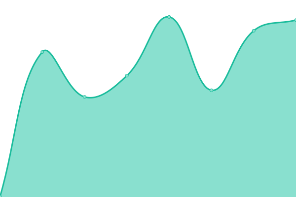
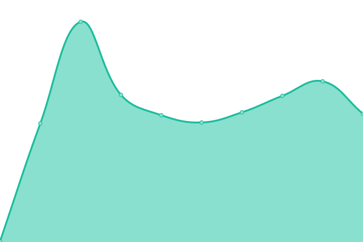
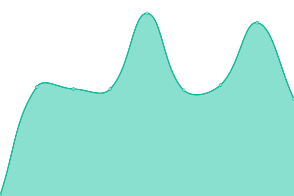

# [📈 Live Status](https://status.finbalanced.com): <!--live status--> **🟧 Partial outage**

This repository contains the open-source uptime monitor and status page for [finbalanced](finbalanced.com), powered by [Upptime](https://github.com/upptime/upptime).

With [Upptime](https://upptime.js.org), you can get your own unlimited and free uptime monitor and status page, powered entirely by a GitHub repository. We use [Issues](https://github.com/finbalanced/status/issues) as incident reports, [Actions](https://github.com/finbalanced/status/actions) as uptime monitors, and [Pages](https://status.finbalanced.com) for the status page.

<!--start: status pages-->
<!-- This summary is generated by Upptime (https://github.com/upptime/upptime) -->
<!-- Do not edit this manually, your changes will be overwritten -->
<!-- prettier-ignore -->
| URL | Status | History | Response Time | Uptime |
| --- | ------ | ------- | ------------- | ------ |
|  [finbalanced Website](https://finbalanced.com) | 🟩 Up | [finbalanced-website.yml](https://github.com/finbalanced/status/commits/HEAD/history/finbalanced-website.yml) | 

 380ms
     
 | 

<a href="https://status.finbalanced.com/history/finbalanced-website">100.00%</a>
    

|  [Backend](https://backend.finbalanced.com/api/health/live) | 🟩 Up | [backend.yml](https://github.com/finbalanced/status/commits/HEAD/history/backend.yml) | 

 1131ms
     
 | 

<a href="https://status.finbalanced.com/history/backend">99.79%</a>
    

|  [Backend Integrations](https://backend.finbalanced.com/api/health/integrations) | 🟩 Up | [backend-integrations.yml](https://github.com/finbalanced/status/commits/HEAD/history/backend-integrations.yml) | 

 319ms
     
 | 

<a href="https://status.finbalanced.com/history/backend-integrations">99.83%</a>
    

|  [Stage-Backend](https://stage.backend.finbalanced.com/api/health/live) | 🟥 Down | [stage-backend.yml](https://github.com/finbalanced/status/commits/HEAD/history/stage-backend.yml) | 

 907ms
     
 | 

<a href="https://status.finbalanced.com/history/stage-backend">99.25%</a>
    

|  [Stage-Backend Integrations](https://stage.backend.finbalanced.com/api/health/integrations) | 🟩 Up | [stage-backend-integrations.yml](https://github.com/finbalanced/status/commits/HEAD/history/stage-backend-integrations.yml) | 

 298ms
     
 | 

<a href="https://status.finbalanced.com/history/stage-backend-integrations">99.83%</a>
    

|  [Content-Management-System](https://cms.finbalanced.com/_health) | 🟩 Up | [content-management-system.yml](https://github.com/finbalanced/status/commits/HEAD/history/content-management-system.yml) | 

 294ms
     
 | 

<a href="https://status.finbalanced.com/history/content-management-system">99.83%</a>
    

|  [Typesense Search Service](https://p4glf3q790ehnd6tp-1.a1.typesense.net/health) | 🟩 Up | [typesense-search-service.yml](https://github.com/finbalanced/status/commits/HEAD/history/typesense-search-service.yml) | 

 521ms
     
 | 

<a href="https://status.finbalanced.com/history/typesense-search-service">100.00%</a>
    

<!--end: status pages-->

[**Visit our status website →**](https://status.finbalanced.com)

## 📄 License

- Powered by: [Upptime](https://github.com/upptime/upptime)
- Code: [MIT](./LICENSE) © [finbalanced](finbalanced.com)
- Data in the `./history` directory: [Open Database License](https://opendatacommons.org/licenses/odbl/1-0/)
